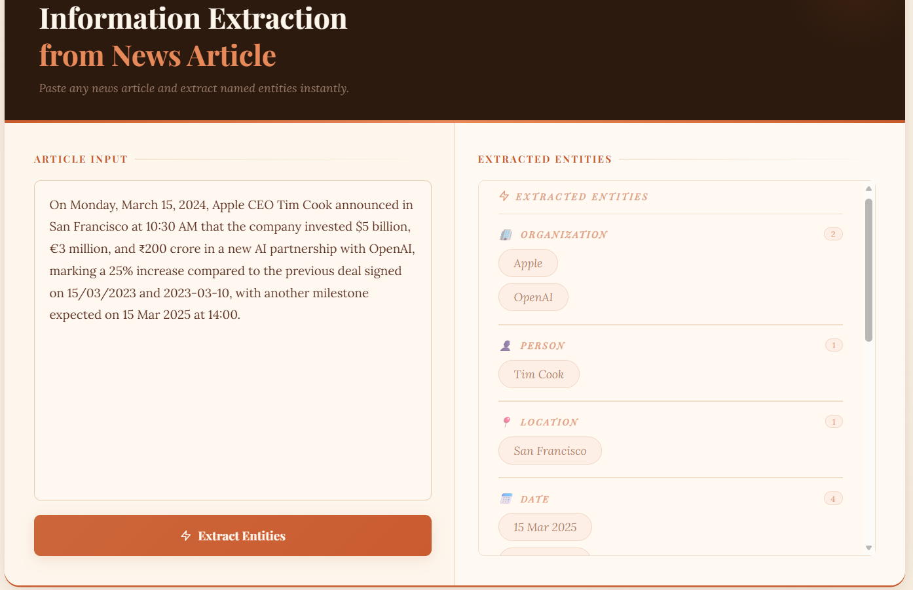
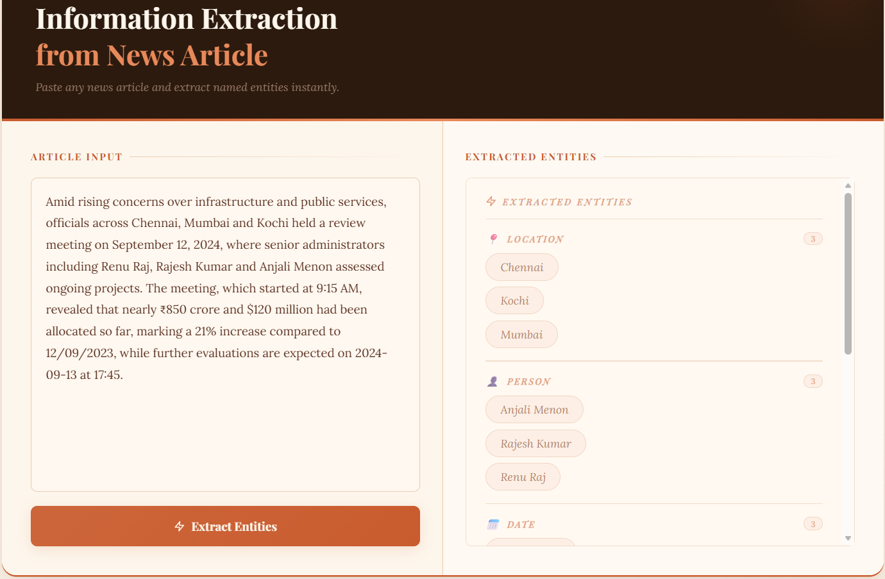

# 🧠 Information Extraction using NLP (SVM + Regex)

[](https://huggingface.co/spaces/marriam-003/information-extraction)

A hybrid **Information Extraction (IE)** system that combines **Regular Expressions (Regex)** and a **Support Vector Machine (SVM)** model to extract structured data from unstructured text.

---

## 🚀 Features
- 🔍 Extracts entities from raw text  
- ⚡ Fast pattern matching using Regex  
- 🧠 Machine learning-based extraction using SVM  
- 🔗 Hybrid pipeline (Rule-based + ML)  
- 📄 Easy to extend and customize  

---

## 🛠️ Tech Stack
- **Language:** Python  
- **Techniques:** NLP, Regex, SVM  

---

## 📂 Project Structure
```bash
.
├── app.py                  # Main application (Hugging Face / Flask app)
├── requirements.txt        # Dependencies

├── svm_ner_model.pkl       # Trained SVM model
├── vectorizer.pkl          # Feature vectorizer (TF-IDF / CountVectorizer)

├── templates/              # HTML templates
│   └── index.html

├── static/                 # Static assets
│   ├── style.css
│   └── script.js

├── Dockerfile              # Deployment configuration (Hugging Face Spaces)
├── .gitattributes          # Git configuration

└── README.md               # Project documentation
```

<p align="center">
  
</p>

<p align="center">
  
</p>
